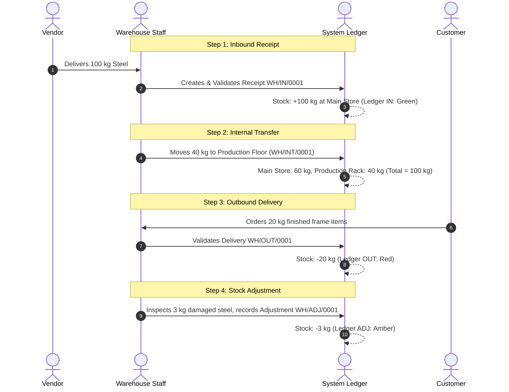

# Product Requirements Document (PRD)
# Project: StockSense — Centralized Real-Time Inventory Management System (IMS)

- **Document Version:** 2.0.0 (Comprehensive Specification)
- **Status:** Approved for Implementation
- **Workspace:** `D:\StockSense`
- **Source References:**
  - Official Problem Statement
  - Excalidraw Wireframe Mockup: [`StockSense - 8 hours.excalidraw`](file:///C:/Users/HP/Downloads/StockSense%20-%208%20hours.excalidraw)

---

## 1. Problem Statement & System Purpose

### 1.1 The Problem
Businesses frequently track inventory using manual paper registers, disconnected Excel sheets, and WhatsApp/email messages. This leads to:
- High rate of stockout surprises and delayed customer deliveries.
- Lost or unaccounted inventory between warehouse racks and production floors.
- Mismatches between recorded book stock and physical bin counts.
- Slow receiving and fulfillment with zero real-time auditability.

### 1.2 The Solution: StockSense
**StockSense** digitizes and centralizes all stock-related operations into a modular, high-speed, real-time web application. Every single physical movement—receiving from a vendor, transferring between racks, delivering to a customer, or recording damaged items—is tracked in an immutable, double-entry **Stock Ledger**.

---

## 2. Target Users & Permissions

| Role | Responsibilities | Key Views Used |
|---|---|---|
| **Inventory Manager** | Oversees all stock flow, sets reordering rules, approves vendor receipts, monitors dashboard KPIs, reconciles adjustments, configures warehouses/locations. | Dashboard, Products, Reorder Rules, Settings, Move History, Reports. |
| **Warehouse Staff** | Performs daily physical handling: receiving incoming goods at docks, executing internal rack transfers, picking and packing deliveries, conducting physical counts. | Operations (Receipts, Deliveries, Internal Transfers, Adjustments), Barcode Scanner. |

---

## 3. Core Modules & Functional Specifications

### 3.1 Authentication & Security
* **Sign Up (`/signup`):**
  * `Login Id`: Unique, length strictly between **6 and 12 alphanumeric characters**.
  * `Email Id`: Unique, validated format.
  * `Password`: Minimum **8 characters**, must contain $\ge 1$ lowercase, $\ge 1$ uppercase, $\ge 1$ special character.
  * `Re-Enter Password`: Must match Password.
* **Log In (`/login`):**
  * `Login Id` & `Password`.
  * Failed attempts display: `"Invalid Login Id or Password"`.
  * Redirects directly to `/dashboard`.
* **OTP-Based Password Reset (`/forgot-password`, `/reset-password`):**
  * Step 1: User enters registered Email / Login ID $\to$ System generates a 6-digit OTP (time-limited to 10 minutes).
  * Step 2: User submits OTP and enters a new password complying with security rules.
  * Step 3: Password updated and user redirected to Login with success toast.

---

### 3.2 Dynamic Inventory Dashboard (`/dashboard`)

The central command center providing an instant pulse of all warehouse operations.

#### Executive KPI Cards
1. **Total Products in Stock:** Total unique SKUs and aggregate count across all warehouses.
2. **Low Stock / Out of Stock Items:** Count of products whose current `Free to Use` stock is $\le$ their configured reorder minimum. Highlighted in amber/red.
3. **Pending Receipts:** Count of incoming supplier shipments in `Draft` or `Ready` state (sub-counters: `Late` where `scheduled_date < Today`, `Operations` where `scheduled_date >= Today`).
4. **Pending Deliveries:** Count of outbound customer orders in `Draft`, `Waiting`, or `Ready` state (sub-counters: `Late`, `Waiting` for stock, `Operations`).
5. **Internal Transfers Scheduled:** Active inter-warehouse or rack-to-rack movements pending completion.

#### Dynamic Multi-Dimensional Filtering Bar
* **By Document Type:** `All` | `Receipts` | `Deliveries` | `Internal Transfers` | `Adjustments`
* **By Status:** `Draft` | `Waiting` | `Ready` | `Done` | `Canceled`
* **By Warehouse / Location:** Dropdown filtering by Warehouse (e.g. `WH`, `Main Store`) and specific sub-locations (`WH/Stock1`, `Production Rack`).
* **By Product Category:** Dropdown (e.g. `Raw Materials`, `Furniture`, `Electronics`, `Finished Goods`).

---

### 3.3 Product Management (`/products`)

* **Product Attributes:**
  * `Name`: (e.g., "Steel Rods", "Desk", "Executive Chair")
  * `SKU / Code`: Unique code (e.g., `[STEEL-001]`, `[DESK001]`)
  * `Category`: (e.g., Raw Materials, Office Furniture, Hardware)
  * `Unit of Measure (UoM)`: Dropdown (Units, kg, meters, boxes, liters)
  * `Per Unit Cost`: Standard purchase/valuation price
  * `Initial Stock`: Optional initial quantity with location allocation on creation
  * `Reordering Rules`:
    * `Min Stock Threshold`: Minimum safety quantity before triggering low-stock alert.
    * `Target Max Quantity`: Recommended reorder quantity.
* **Inventory Balance Transparency:**
  * `On Hand`: Total physical count located in warehouse bins.
  * `Free to Use`: Actual available count:
    $$\text{Free to Use} = \text{On Hand} - \sum \text{Allocated in 'Ready' Deliveries}$$
* **Stock Availability Per Location:**
  * Drill-down modal showing stock breakdown per warehouse and bin location (e.g., 60 units in `WH/Stock1`, 40 units in `WH/Stock2`).

---

### 3.4 Operations: Receipts (Incoming Goods)

* **Route:** `/operations/receipts`
* **Reference Format:** `<Warehouse>/<Operation>/<ID>` (e.g., `WH/IN/0001` auto-incrementing).
* **Views:** Default **List View** with toggle to **Kanban View** (`Draft`, `Ready`, `Done`).
* **Search / Filter:** By Reference, Supplier / Contact, Status.
* **Fields:**
  * `Reference`: Auto-generated read-only string.
  * `Receive From / Supplier`: Vendor contact (e.g., `Azure Interior`, `Tata Steel`).
  * `Destination Location`: Target bin (default: `WH/Stock1`).
  * `Schedule Date`: Date picker.
  * `Responsible`: Auto-filled with logged-in user.
* **Line Items:** `Product`, `UoM`, `Quantity Received`, `Unit Price`.
* **State Machine & Actions:**
  $$\text{Draft} \xrightarrow{\text{To Do}} \text{Ready} \xrightarrow{\text{Validate}} \text{Done}$$
  * `To Do`: Moves order from `Draft` to `Ready`.
  * `Validate`: Atomically credits product quantities to destination location and writes `IN` move to Stock Ledger (Green).
  * `Print`: Available once `Done` to print receipt slip with QR code.
  * `Cancel`: Voids the order.

---

### 3.5 Operations: Delivery Orders (Outgoing Goods)

* **Route:** `/operations/deliveries`
* **Reference Format:** `WH/OUT/0001` (Auto-incrementing).
* **Views:** Default **List View** with toggle to **Kanban View** (`Draft`, `Waiting`, `Ready`, `Done`).
* **Fields:** `Reference`, `Customer / Delivery Address`, `Source Location` (`WH/Stock1`), `Schedule Date`, `Responsible`.
* **Line Items:** `Product`, `UoM`, `Quantity Demanded`, `Availability Status`.
* **Out-of-Stock Alert & Allocation Logic:**
  * If requested quantity $>$ `Free to Use` stock:
    * Line is styled with **Red alert** styling.
    * Badge displayed: `"Insufficient Stock (Demanded: X, Free: Y)"`.
    * Order status automatically transitions to `Waiting`.
    * `Validate` action is disabled.
* **State Machine:**
  $$\text{Draft} \longrightarrow \text{Waiting (if stock shortage)} \longrightarrow \text{Ready} \xrightarrow{\text{Validate}} \text{Done}$$
  * When stock becomes available: Order moves to `Ready` and stock is reserved.
  * `Validate`: Atomically deducts `On Hand` inventory, debits location, and logs `OUT` move to Stock Ledger (Red).

---

### 3.6 Operations: Internal Transfers (Movement Inside Business)

* **Route:** `/operations/transfers`
* **Purpose:** Move stock between company locations without changing total company inventory.
  * Examples:
    * `Main Store` $\longrightarrow$ `Production Rack`
    * `Rack A` $\longrightarrow$ `Rack B`
    * `Warehouse 1` $\longrightarrow$ `Warehouse 2`
* **Reference Format:** `WH/INT/0001` (Auto-incrementing).
* **Fields:**
  * `Reference`
  * `Source Location (From)`: e.g. `WH/Stock1`
  * `Destination Location (To)`: e.g. `WH/Production-Rack`
  * `Schedule Date`
  * `Responsible`
  * `Products Table`: Product, Quantity to transfer.
* **Execution:**
  * `Validate`: Decrements source location balance, increments destination location balance. Total company stock remains unchanged. Logged in Stock Ledger as `INTERNAL` transfer.

---

### 3.7 Operations: Stock Adjustments (Physical Reconciliation)

* **Route:** `/operations/adjustments`
* **Purpose:** Resolve mismatches between recorded software stock and physical bin counts (e.g. damaged goods, shrinkage, found items).
* **Reference Format:** `WH/ADJ/0001`
* **Workflow:**
  1. User selects `Product` and `Location` (e.g., "Steel Rods" at `WH/Stock1`).
  2. System displays current **Recorded Stock** (e.g., `100 kg`).
  3. User enters **Counted Physical Quantity** (e.g., `97 kg`).
  4. System computes **Difference / Discrepancy** (e.g., `-3 kg` damaged).
  5. User inputs Reason (e.g., "Damaged in transit", "Annual physical count").
  6. On `Apply Adjustment`: System overwrites on-hand count with physical count and records a compensating ledger entry (`ADJUSTMENT`).

---

### 3.8 Stock Move History (The Universal Stock Ledger)

* **Route:** `/move-history`
* **The Foundation of StockSense:** Every incoming, outgoing, transfer, and adjustment operation creates immutable ledger entries.
* **Core Rules:**
  1. **Multi-Row Line Expansion:** Orders containing multiple products explode into individual rows per product.
  2. **Color-Coded Badges:**
     * **IN** moves (Vendor $\to$ WH): Highlighted in **Emerald Green** (`+ Quantity`).
     * **OUT** moves (WH $\to$ Customer): Highlighted in **Rose Red** (`- Quantity`).
     * **INTERNAL** moves (Location $\to$ Location): Highlighted in **Blue/Neutral**.
     * **ADJUSTMENT** moves: Highlighted in **Amber**.
* **Table Columns:** `Reference`, `Date & Time`, `Product (SKU & Name)`, `From Location`, `To Location`, `Contact`, `Quantity & UoM`, `Type`, `Status`.
* **Filters:** Search by Reference, Contact, Product SKU, Date Range.

---

### 3.9 Settings: Multi-Warehouse & Locations Hierarchy

* **Warehouses (`/settings/warehouses`):**
  * `Name`: Facility Name (e.g. "Main Distribution Hub").
  * `Short Code`: Code prefix for sequences (e.g. `WH`, `MSTORE`).
  * `Address`: Physical address.
* **Locations (`/settings/locations`):**
  * Hierarchy: Facility $\to$ Zones $\to$ Racks $\to$ Bins.
  * `Name`: (e.g. "Stock Area 1", "Production Rack", "Damaged Scrap Bin").
  * `Short Code`: (e.g. `WH/Stock1`, `WH/Rack-A`).
  * `Warehouse`: Foreign Key to Warehouse.
  * `Location Type`: Internal / Vendor / Customer / Inventory Loss.

---

## 4. Competitive Differentiators Researched & Built-in

1. **In-App Camera Barcode & QR Scanner:**
   * Browser-based camera scanner (`html5-qrcode`) for quick SKU lookup, receiving, and dispatching without RF terminal hardware.
2. **Proactive Low-Stock & Reorder Alerts:**
   * Dashboard badges and automated purchase receipt suggestions when items fall below safety thresholds.
3. **Interactive 2D Visual Warehouse Floor Map:**
   * Visual rack occupancy overview with bin fill percentages.
4. **Print Ready Slips:**
   * Formal, printable warehouse delivery notes and receipts formatted with barcodes and verification QR codes.

---

## 5. End-to-End Walkthrough Example (Problem Statement Aligned)

