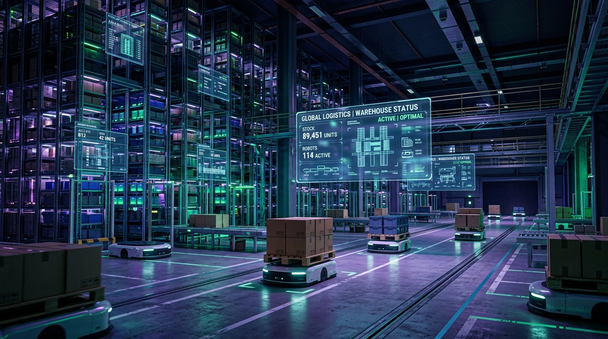
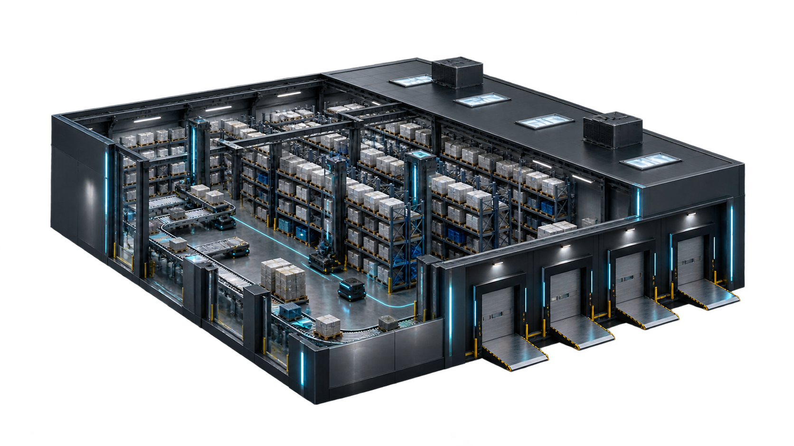
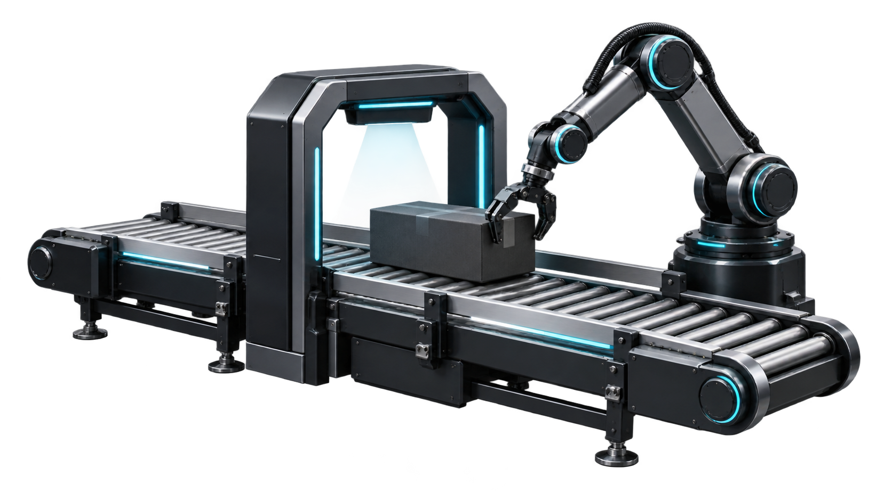
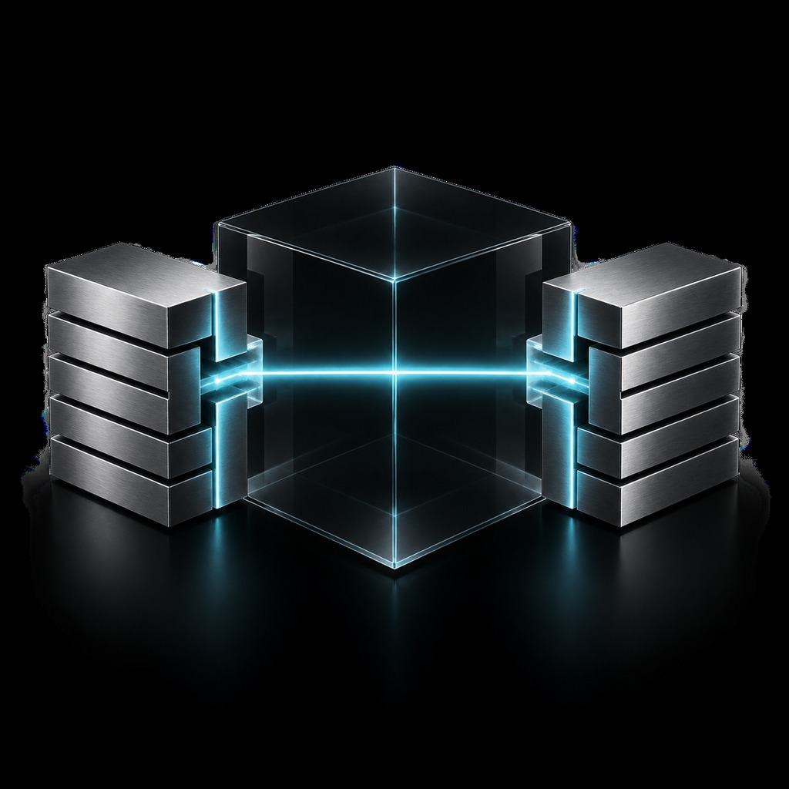
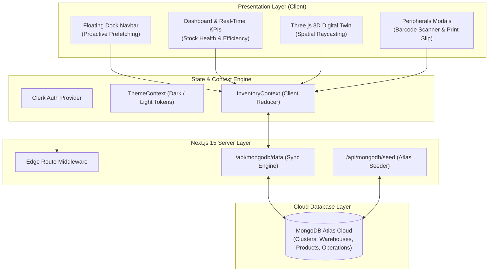
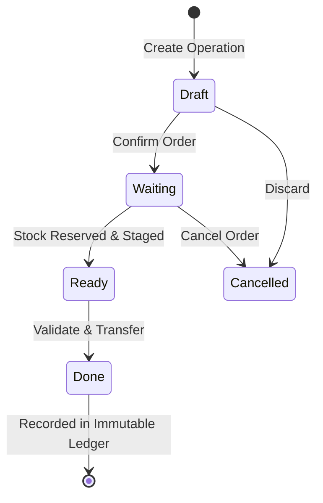

<div align="center">

# 📦 StockSense WMS
### Centralized Real-Time Inventory & Warehouse Management System
**Built for the Odoo x LPU National Hackathon 2026**

[](https://nextjs.org/)
[](https://react.dev/)
[](https://www.typescriptlang.org/)
[](https://tailwindcss.com/)
[](https://www.mongodb.com/)
[](https://threejs.org/)
[](https://clerk.com/)
[](https://vercel.com/)

<br/>



<p align="center">
  <b>Modern, reactive, and visually breathtaking supply-chain engine delivering sub-second stock traceability, interactive 3D digital twins, camera barcode scanning, and multi-warehouse operations.</b>
</p>

[Live Demo](#-live-deployment) • [Key Capabilities](#-core-capabilities) • [3D Digital Twin](#-interactive-3d-digital-twin) • [Architecture](#-system-architecture) • [Getting Started](#-getting-started) • [Team](#-the-team)

</div>

---

## 🌟 Executive Overview

StockSense solves the latency and opacity challenges in modern logistics. Traditional warehouse tools suffer from disjointed data silos, manual paperwork, and delayed reconciliation. 

StockSense unifies inventory tracking, inbound logistics, outbound fulfillment, inter-warehouse transfers, and physical audits into a **single centralized real-time platform** with:
- **Instant Reactive Ledger:** Every movement creates an immutable audit trail.
- **Physical-to-Digital Sync:** Interactive Three.js 3D spatial twin with live rack occupancy.
- **Enterprise Product Database:** 100 pre-configured industrial SKUs across 7 categories with sub-second pagination.
- **Hardware Integration:** Browser-based optical camera barcode scanner and thermal delivery slip generation.

---

## 📸 Visual Showcase & Capabilities

<div align="center">
  <table>
    <tr>
      <td width="50%">
        
        <p align="center"><b>Interactive 3D Digital Twin</b><br/>Real-time spatial visualization with rack raycasting</p>
      </td>
      <td width="50%">
        
        <p align="center"><b>Operations Fulfillment Kanban</b><br/>Multi-state delivery tracking (Draft → Waiting → Ready → Done)</p>
      </td>
    </tr>
    <tr>
      <td width="50%">
        
        <p align="center"><b>Optical Barcode & SKU Scanner</b><br/>Instant camera-based picking and validation</p>
      </td>
      <td width="50%">
        
        <p align="center"><b>Immutable Stock Movement Ledger</b><br/>Complete traceability with chronological audits</p>
      </td>
    </tr>
  </table>
</div>

---

## ⚡ Core Capabilities

### 1. 🏢 Multi-Warehouse & Hierarchical Storage
- Configure multiple warehouse sites (e.g., *Main Fulfillment Hub*, *North Logistics Depot*).
- Define zoned internal locations: `WH/Stock`, `WH/Input`, `WH/Output`, `WH/Picking-A1`, `WH/Scrap`.
- Real-time location occupancy metrics and storage utilization meters.

### 2. 🧊 Interactive 3D Spatial Digital Twin (`/warehouse-3d`)
- Full WebGL spatial representation powered by **Three.js** and OrbitControls.
- Real-time rack meshes colored by dynamic stock thresholds (Green = Optimal, Amber = Near Capacity, Red = Critical).
- Raycaster-driven click inspection: tap any physical rack to inspect live SKU payloads, shelf levels, and batch allocations.

### 3. 📦 100+ Enterprise SKU Catalog (`/products`)
- Curated catalog covering **Furniture, Raw Materials, Electronics, Fasteners, Safety, Packaging, and Heavy Machinery**.
- Client-side virtualization & snappy pagination (15 items/page) delivering ~300ms page transitions.
- Multi-criteria filtering by category, stock alert status, warehouse availability, and keyword search.

### 4. 🔄 End-to-End Operations Workflows
- **Inbound Receipts (`/operations/receipts`):** Vendor purchase orders, multi-line item intake, and receiving staging.
- **Outbound Deliveries (`/operations/deliveries`):** Sales order fulfillment with dual Kanban & list views, automated stock reservation, and thermal slip generation.
- **Internal Transfers (`/operations/transfers`):** Rebalance stock across warehouses and zones with zero discrepancy.
- **Stock Adjustments (`/operations/adjustments`):** Periodic physical count reconciliation and automated scrap tracking.

### 5. 🖨️ Hardware & Peripheral Integration
- **Live Camera Barcode Scanner:** Real-time QR and 1D barcode scanner modal directly accessing the device camera.
- **Thermal Delivery Slip Generator:** Formatted packing slips with dynamic barcodes, ready for 80mm industrial label printers.
- **2D Visual Blueprint Map:** Interactive SVG floorplan with clickable storage zones.

### 6. 🔐 Dual Authentication & Cloud Sync
- **Clerk Enterprise Auth:** Sign-in with Google, email magic links, and secure session management.
- **One-Click Demo Guest Access:** Instant evaluator onboarding without registration friction.
- **MongoDB Atlas Synchronization:** Automated seeding endpoint (`/api/mongodb/seed`) and floating quick-seed widget.

---

## 🏗️ System Architecture



---

## 🔄 Operations State Machine



---

## 🛠️ Technology Stack

| Layer | Technologies |
| :--- | :--- |
| **Framework** | [Next.js 15 (App Router)](https://nextjs.org/) |
| **Core Library** | [React 19](https://react.dev/) |
| **Language** | [TypeScript (Strict Mode)](https://www.typescriptlang.org/) |
| **Styling** | [Tailwind CSS v4](https://tailwindcss.com/) + Custom Glassmorphism System |
| **3D Rendering** | [Three.js](https://threejs.org/) (WebGL Canvas & Orbit Controls) |
| **Cloud Database** | [MongoDB Atlas](https://www.mongodb.com/) (Mongoose / Native Driver) |
| **Authentication** | [Clerk SSO](https://clerk.com/) + Custom Guest Bypass Engine |
| **Icons & Visuals** | [Lucide React](https://lucide.dev/) |
| **Charts** | HTML5 Canvas & Custom SVG Visualizers |
| **Deployment** | [Vercel](https://vercel.com/) |

---

## 🚀 Getting Started

### Prerequisites
- Node.js `18.17+` or `20+`
- npm, yarn, or pnpm
- Git

### 1. Clone the Repository
```bash
git clone https://github.com/AyaanHub0810/odoo-lpu-hackathon-2026.git
cd odoo-lpu-hackathon-2026
```

### 2. Install Dependencies
```bash
npm install
```

### 3. Setup Environment Variables
Create a `.env.local` file in the root directory (or copy from `.env.example`):
```bash
cp .env.example .env.local
```

Fill in your Clerk and MongoDB credentials:
```env
# Clerk Authentication
NEXT_PUBLIC_CLERK_PUBLISHABLE_KEY=pk_test_...
CLERK_SECRET_KEY=sk_test_...

# Clerk Redirects
NEXT_PUBLIC_CLERK_SIGN_IN_URL=/sign-in
NEXT_PUBLIC_CLERK_SIGN_UP_URL=/sign-up
NEXT_PUBLIC_CLERK_AFTER_SIGN_IN_URL=/dashboard
NEXT_PUBLIC_CLERK_AFTER_SIGN_UP_URL=/dashboard

# MongoDB Atlas
MONGODB_URI=mongodb+srv://<username>:<password>@cluster.mongodb.net/stocksense?retryWrites=true&w=majority
```

### 4. Run Development Server
```bash
npm run dev
```

Open [http://localhost:3000](http://localhost:3000) with your browser.

---

## 🌐 Vercel Deployment

StockSense is optimized for zero-config deployment on Vercel:

1. Push your repository to GitHub.
2. In [Vercel Dashboard](https://vercel.com/new), click **"Import Project"** and select `AyaanHub0810/odoo-lpu-hackathon-2026`.
3. Add the environment variables from `.env.local` in the Vercel project settings:
   - `NEXT_PUBLIC_CLERK_PUBLISHABLE_KEY`
   - `CLERK_SECRET_KEY`
   - `MONGODB_URI`
4. Click **Deploy**. Vercel will automatically build the Next.js production bundle.

---

## 👥 The Team

Developed with passion by **Team StockSense** for the **Odoo x LPU Hackathon 2026**:

| Name | Role | Responsibilities | GitHub |
| :--- | :--- | :--- | :--- |
| **Ayaan** | Team Lead / DevOps & Cloud | Project Architecture, Clerk Auth, MongoDB Atlas APIs, Middleware | [@AyaanHub0810](https://github.com/AyaanHub0810) |
| **Krishna** | Core Inventory & Operations | Data Models, Operations Workflows (Receipts/Deliveries/Transfers), 100 SKU Catalog | [@krrisshhannaa](https://github.com/krrisshhannaa) |
| **Divyanshi** | UI/UX & Real-Time Analytics | Floating Dock, Theme Engine, Pagination, Route Prefetching, KPI Charts | [@divyanshi12divya](https://github.com/divyanshi12divya) |
| **Bani** | 3D Digital Twin & Peripherals | Three.js Spatial Visualizer, Barcode Scanner, Thermal Slips, Settings | [@bani070507](https://github.com/bani070507) |

---

<div align="center">
  <b>StockSense WMS</b> — Redefining Warehouse Intelligence for Industrial Supply Chains.<br/>
  <i>Odoo x LPU Hackathon 2026 • Jalandhar, India</i>
</div>
